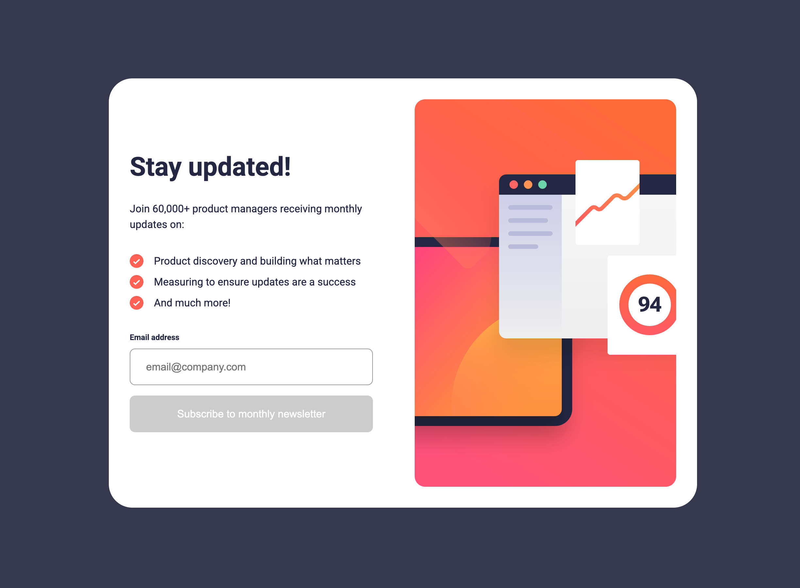

# Frontend Mentor - Newsletter sign-up form with success message solution

This is a solution to the [Newsletter sign-up form with success message challenge on Frontend Mentor](https://www.frontendmentor.io/challenges/newsletter-signup-form-with-success-message-3FC1AZbNrv). Frontend Mentor challenges help you improve your coding skills by building realistic projects.

## Table of contents

- [Frontend Mentor - Newsletter sign-up form with success message solution](#frontend-mentor---newsletter-sign-up-form-with-success-message-solution)
  - [Table of contents](#table-of-contents)
  - [Overview](#overview)
    - [The challenge](#the-challenge)
    - [Screenshot](#screenshot)
    - [Links](#links)
  - [My process](#my-process)
    - [Built with](#built-with)
    - [What I learned](#what-i-learned)
    - [Continued development](#continued-development)
    - [Useful resources](#useful-resources)
  - [Author](#author)
  - [Acknowledgments](#acknowledgments)

## Overview

### The challenge

Users should be able to:

-   Add their email and submit the form
-   See a success message with their email after successfully submitting the form
-   See form validation messages if:
    -   The field is left empty
    -   The email address is not formatted correctly
-   View the optimal layout for the interface depending on their device's screen size
-   See hover and focus states for all interactive elements on the page

### Screenshot

### Links

-   Solution URL: [https://github.com/EmLopezDev/Newsletter-Sign-Up](https://github.com/EmLopezDev/Newsletter-Sign-Up)
-   Live Site URL: [https://emlopezdev.github.io/Newsletter-Sign-Up/](https://emlopezdev.github.io/Newsletter-Sign-Up/)

## My process

-   First I built the default state of the card starting with the mobile view and working my way to the desktop view.
-   Then I built out the success view again starting with the mobile view and hid it to be shown with JS.
-   After I added all the error and disable state but also hid them to be shown with JS.
-   Finally I added validation to the form and the submit event which trigger the different views and states on the card depending on certain conditions.

### Built with

-   Semantic HTML5 markup
-   SCSS custom properties, function and mixins
-   Flexbox
-   Mobile-first workflow
-   Vanilla JavaScript

### What I learned

-   How to replace the ul bullets with an image.
-   Basic validation for a form.
-   How to change the focus look of an input.

### Continued development

-   Would like to continue working with vanilla JS in general. When I started coding I didn't spend enough time on it before jumping into React and I feel I missed learning some essentials.
-

### Useful resources

-   [Input Focus](https://sentry.io/answers/how-to-remove-focus-border-outline-around-text-input-boxes/) - Simple way to manipulate the focus on inputs

## Author

-   Frontend Mentor - [@EmLopezDev](https://www.frontendmentor.io/profile/EmLopezDev)

## Acknowledgments

Not sure of their real name, but their discord handle is Darkstar. I wanted to give them a big shout out for helping me figure why the background image wasn't working when I deployed my site. Turns out it was a simple incorrect path, but regardless thank you.
